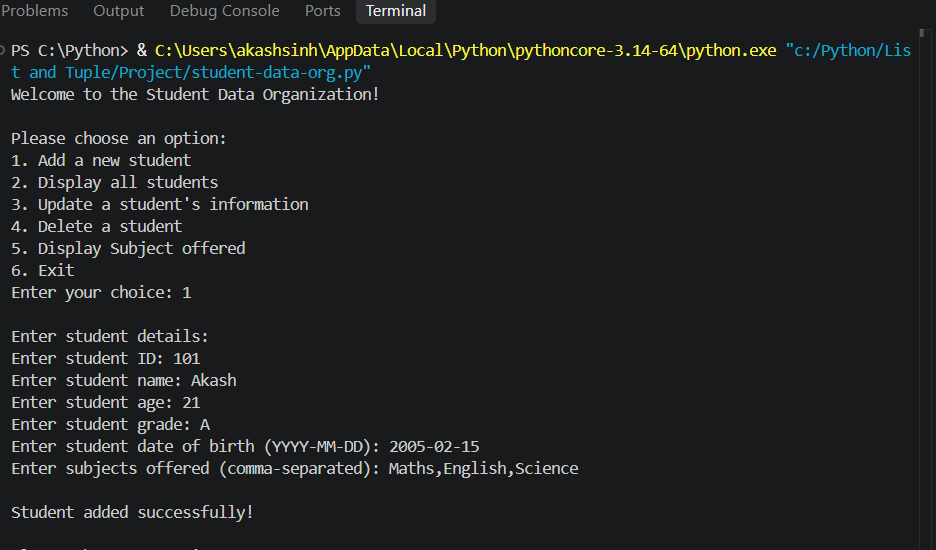
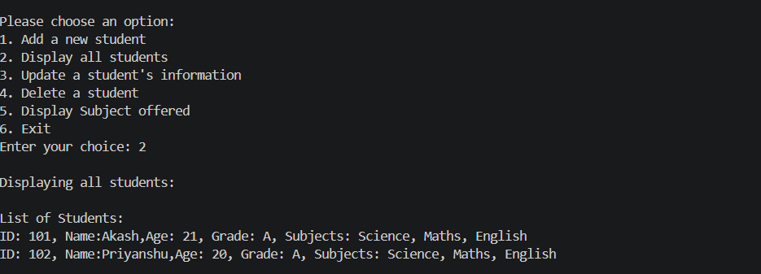
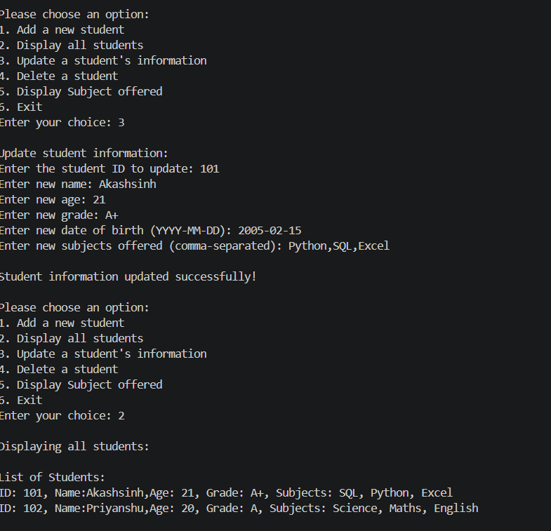
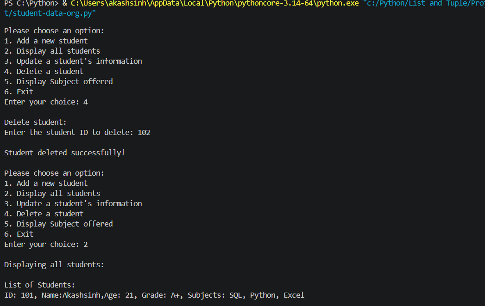
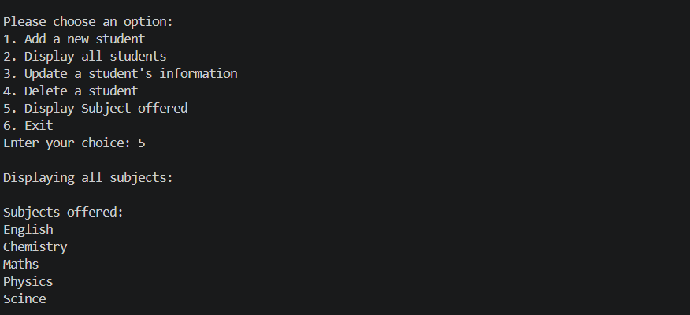
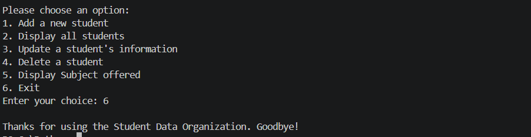

# Student Data Organization

A simple Python console-based project for managing student information.

## Features

* Add a new student
* Display all students
* Update student information
* Delete a student
* Display all subjects offered
* Exit the program

## Student Information

The program stores the following information for each student:

* Student ID
* Student Name
* Age
* Grade
* Date of Birth
* Subjects

## Python Concepts Used

This project was created to practice fundamental Python concepts:

* List
* Tuple
* Set
* Dictionary
* `while` loop
* `for` loop
* `if-else` conditions
* `match-case`
* User input
* String methods
* Dictionary methods
* Set methods
* List methods

## Data Structures Used

### List

A list is used to store multiple students.

```python
students = []
```

### Dictionary

Each student is stored as a dictionary containing their information.

```python
student = {
    "identity": student_identity,
    "name": name,
    "age": age,
    "grade": grade,
    "dob": dob,
    "subjects": subjects
}
```

### Tuple

A tuple is used to store the student's ID and date of birth as an identity.

```python
student_identity = (student_id, dob)
```

### Set

A set is used to store subjects so that duplicate subjects are not stored.

```python
subjects = set(input("Enter subjects offered (comma-separated): ").split(","))
```

## Menu Options

When the program starts, it displays the following menu:

```text
1. Add a new student
2. Display all students
3. Update a student's information
4. Delete a student
5. Display Subject offered
6. Exit
```

### 1. Add a New Student

The user enters the student's ID, name, age, grade, date of birth, and subjects.



### 2. Display All Students

Displays all students currently stored in the program.



### 3. Update Student Information

The user enters a student ID.

If the student exists, their name, age, grade, date of birth, and subjects can be updated.



### 4. Delete Student

The user enters a student ID.

If the student is found, their information is removed from the `students` list.



### 5. Display Subjects Offered

The program collects subjects from all students into one set.

This prevents duplicate subjects from being displayed.



### 6. Exit

Exits the program and displays a goodbye message.


## Purpose

The purpose of this project is to practice Python data structures and basic programming logic by building a small real-world student management system.

